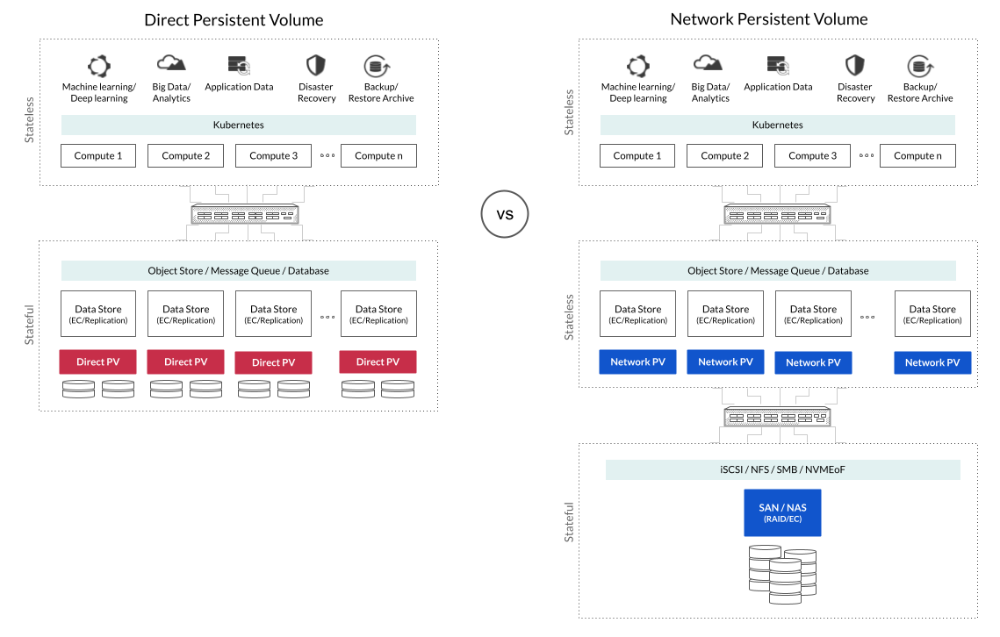

This set of pages describes [MinIO DirectPV](https://github.com/minio/directpv), an AGPL3.0-licensed Container Storage Interface (CSI) for direct attached storage.

DirectPV consists of two primary components:

1. The **DirectPV CSI Driver** installed directly to the Kubernetes cluster that provisions local volumes
2. The **DirectPV Plugin** installed on the local machine to manage the DirectPV CSI Driver through the command line interface

At the basic level, DirectPV is a distributed persistent volume manager.
DirectPV is not a storage system like a SAN (Storage Area Network) or a NAS (Network Attached Storage). 
Instead, you use DirectPV to discover, format, mount, schedule and monitor drives across servers in a distributed environment.

DirectPV uses these mounted drives to create [persistent volumes (PV)](https://kubernetes.io/docs/concepts/storage/persistent-volumes/) that Kubernetes uses to fulfill persistent volume claims (PVCs).

<!---
DirectPV exists to address an issue in Kubernetes where `hostPath` and local persistent volumes are statically provisioned and limited in functionality.
-->

Distributed data stores such as object storage, databases, and message queues benefit the most from direct attached storage.
These solutions, built for the distributed environment, should handle high availability and data durability by themselves. 
Running such data stores on traditional SAN- or NAS-based CSI drivers adds an unnecessary layer of replication or erasure coding, resulting in extra network hops in the data path. 
Such additional layers of disaggregation result in increased complexity and poor performance.

## Installation and Upgrades

 - [Install DirectPV]()
 - [Upgrade DirectPV]()

## Concepts

- [Architecture]()
- [Metrics and Monitoring]()
- [DirectPV Specification]() 

## Managing Resources

- [Resource Types]()
- [Drives]()
- [Nodes]()
- [Volumes]()
- [Schedule volumes by labels]()
- [Schedule volumes]()
- [Useful Scripts]()
 
## Frequently Asked Questions

- [Frequently Asked Questions]()
- [Troubleshooting]()

## Command Line Interface (CLI)

 - [CLI reference]()

<!--- 
 - [Usage Guide](./usage-guide)
 - [Upgrades](./cli/upgrades) 
 
### Advanced
 - [Internals](./internals)
-->

## External References

- [MinIO Object Store Documentation](https://docs.min.io/community/minio-object-store?jmp=docs-directpv) 
- [Kubernetes CSI](https://kubernetes.io/blog/2019/01/15/container-storage-interface-ga/)
