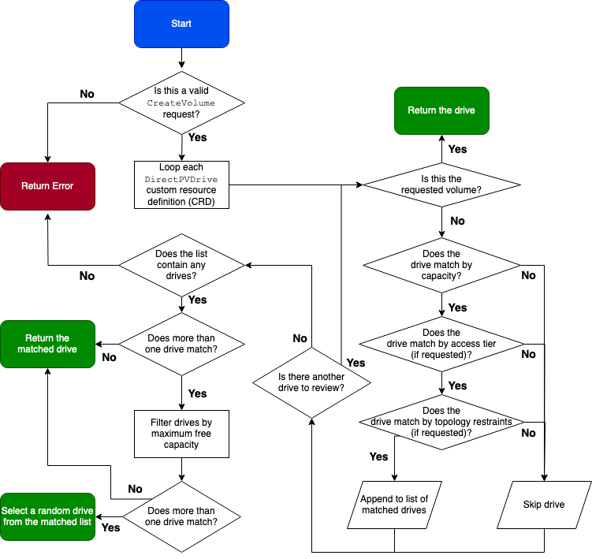

## Overview

DirectPV provisions drives for pods that provide a `PersistentVolumeClaim` for the DirectPV storage class.

`DirectPV` includes a storage class named `directpv-min-io` with [volume binding mode](https://kubernetes.io/docs/concepts/storage/storage-classes/#volume-binding-mode) `WaitForFirstConsumer`.
This mode delays volume binding and provisioning of a `PersistentVolume` until the creation of a `Pod` using the `PersistentVolumeClaim`. 

## Volume Constraints

The pod may include additional constraints for the persistent volume claim.
DirectPV selects and provisions Persistent Volumes that conform to the topology specified by the Pod's scheduling constraints. 

Some examples of scheduling restraints include:

- resource requirements such as capacity
- node selectors
- pod affinity and anti-affinity
- taints and tolerations

## Drive selection

The following sequence and flowchart show how the DirectPV CSI controller selects a suitable drive for a `CreateVolume` request.

1. Validate that the filesystem type in the request is `xfs`.
   DirectPV only supports the `xfs` filesystem.
2. Validate any access-tier in the request.
3. Check for the presence of the volume requested in the `DirectPVDrive` CRD object. 
   If present, the DirectPV schedules the first drive containing the volume.
4. If no `DirectPVDrive` CRD object has the requested volume, DirectPV reviews each drive by:
 
   - requested capacity
   - access-tier (if requested)
   - topology constraints (if requested)
5. If this process selects more than one drive, DirectPV selects the drive(s) with the greatest free capacity.
6. If more than one drive has the same greatest available capacity, DirectPV schedules one of the selected drives at random.
7. Update the scheduled drive with requested volume information.

Note the following behaviors:

- If no drives match, DirectPV returns an error.
- In case of any error, Kubernetes retries the request.
- In the event two or more parallel requests schedule the same drive, the drive successfully schedules for one request. 
  All other requests fail and retry.

